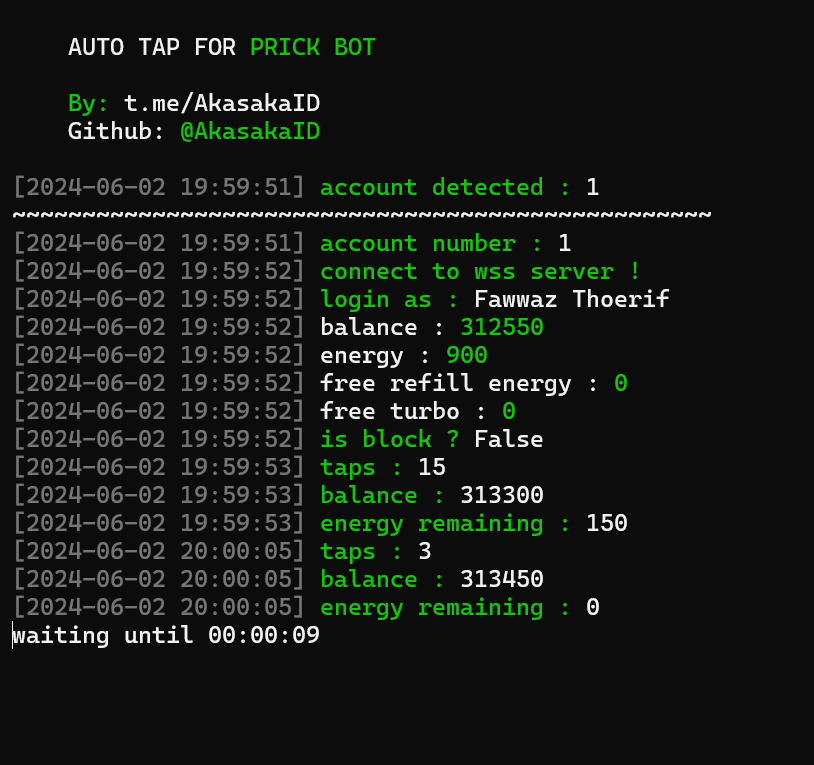

# Pricktod

Auto Tap for Prick Game Telegram Bot

<center></center>

# Features

- [x] Auto Tap
- [x] Auto Use Refill Energy
- [x] Auto Use Turbo
- [x] Support Multi Account !
- [x] Only Use Telegram ID

# Register

Start bot first [HERE](https://t.me/Prickgame_bot?start=ref-aMBEqvj2WaHSqbWj15gXJ2)

# How to use 

1. Make sure your computer has installed python and git.
   
2. Clone this repository !
   ```shell
   git clone https://github.com/akasakaid/pricktod.git
   ```

3. Goto pricktod directory
   
   ```shell
   cd pricktod
   ```

4. Open `id.txt` file and remove all content first, then paste your telegram id. 1 line for one telegram id
   
   Example
   ```txt
   123456789
   098765443
   123345667
   ```

5. Install Python Library
   
   Windows

   ```shell
   pip install -r requirements.txt
   ```

   Or

   ```shell
   python -m pip install -r requirements.txt
   ```

   Linux

   ```shell
   pip3 install -r requirements.txt
   ```

   Or

   ```shell
   python3 -m pip install -r requirements.txt
   ```

6. Run Bot
   
   Windows

   ```shell
   python bot.py
   ```

   Linux

   ```shell
   python3 bot.py
   ```

# Support 

Buy me a coffee to support me

- [https://trakteer.id/fawwazthoerif/tip](https://trakteer.id/fawwazthoerif/tip)
- [https://sociabuzz.com/fawwazthoerif/tribe](https://sociabuzz.com/fawwazthoerif/tribe)

# Discussion

If you have anyq question you can join and ask in : [@sdsproject_chat](https://t.me/sdsproject_chat)

# Thank You